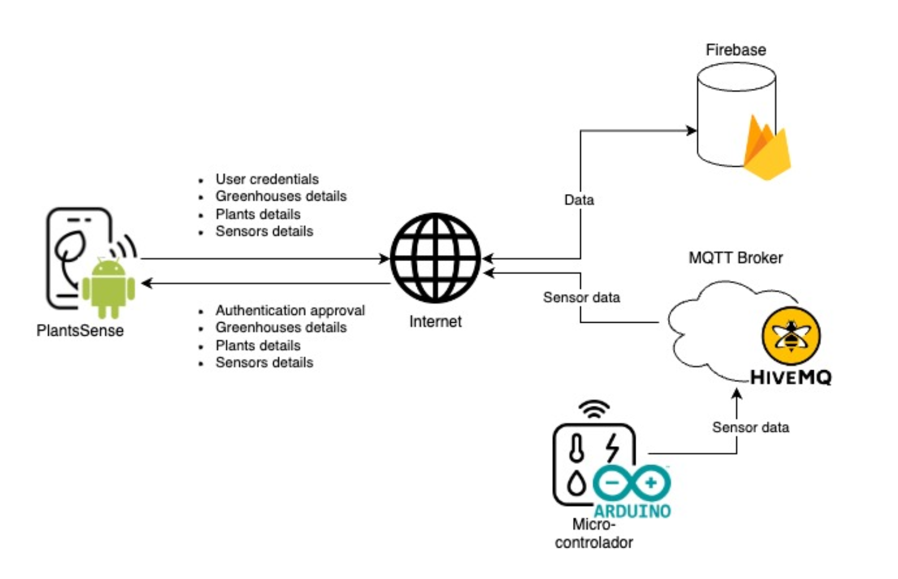

# 🌱 PlantsSense

**PlantsSense** is a mobile application for **greenhouse and plant monitoring**, integrating IoT sensors, real-time data communication, and cloud-based services. The system enables users to manage multiple greenhouses and plants, monitor environmental conditions, and visualize sensor data through an intuitive Android application.

This project was developed as part of an academic work focused on IoT-based mobile computing.


## 📱 Project Overview

PlantsSense provides a centralized platform to:

- Manage **multiple greenhouses per user**
- Monitor **plant-specific environmental conditions**
- Visualize **real-time and historical sensor data**
- Store greenhouse metadata, images, and sensor information securely
- Communicate with microcontrollers using **MQTT**

The system combines a **mobile application**, **cloud services**, and **IoT devices** to support efficient and scalable greenhouse monitoring.


## 🏗️ System Architecture

The architecture follows a client–server model with real-time messaging support:

- **Mobile Application (Android – Java)**
- **Firebase** for authentication, database, and image storage
- **MQTT Broker (HiveMQ)** for real-time sensor communication
- **Microcontrollers (Arduino)** for sensor data acquisition

<p align="center">
  
  <br>
  <em>Figure: High-level architecture of the PlantsSense application.</em>
</p>

### Data Flow
1. Sensors collect environmental data (e.g., temperature, humidity)
2. Microcontrollers publish data to the MQTT broker
3. The mobile app and backend services receive updates in real time
4. Data is stored and retrieved via Firebase services


## 🧩 Core Components

### 📱 Mobile Application
- User authentication (email & password)
- Greenhouse and plant management
- Sensor data visualization (graphs and live values)
- Image gallery and greenhouse localization
- Clean and user-friendly UI

### 🔐 Authentication
- Managed via **Firebase Authentication**
- Secure access to user-specific data

### 🗄️ Database as a Service
- Implemented using **Firebase**
- Stores:
  - User credentials
  - Greenhouse details
  - Plant information
  - Sensor metadata
  - Historical sensor readings

### 📡 MQTT Broker
- Real-time data transmission using **HiveMQ**
- Acts as a centralized message dispatcher between devices and services

### 🔌 Microcontroller
- Arduino-based devices installed in greenhouses
- Collect environmental data such as:
  - Temperature
  - Humidity
- Publish sensor data via MQTT


## 🧠 Application Architecture

The mobile app follows the **Model–View–ViewModel (MVVM)** pattern:

- **Model** – Application data and business logic
- **View** – User interface components
- **ViewModel** – Communication layer between View and Model

This structure ensures modularity, scalability, and maintainability.


## 🖼️ Application Features

- Greenhouse list and detail views
- Plant-specific monitoring
- Sensor detail view with historical graphs
- Image gallery for greenhouses
- Greenhouse localization map
- Real-time updates using MQTT


## 🛠️ Technologies Used

- **Android (Java)**
- **Firebase Authentication**
- **Firebase Realtime Database / Firestore**
- **Firebase Storage**
- **MQTT Protocol**
- **HiveMQ**
- **Arduino**
- **MVVM Architecture**


## 🚀 Getting Started

### Prerequisites
- Android Studio
- Firebase account
- HiveMQ broker credentials
- Arduino-compatible microcontroller with sensors

### Setup
1. Clone the repository:
   ```bash
   git clone https://github.com/Bruna248/PlantsSense.git
   ```
2. Open the project in Android Studio
3. Configure Firebase:
- Authentication
- Database
- Storage
4. Update MQTT broker credentials
5. Deploy Arduino code to the microcontroller
6. Run the app on an Android device or emulator